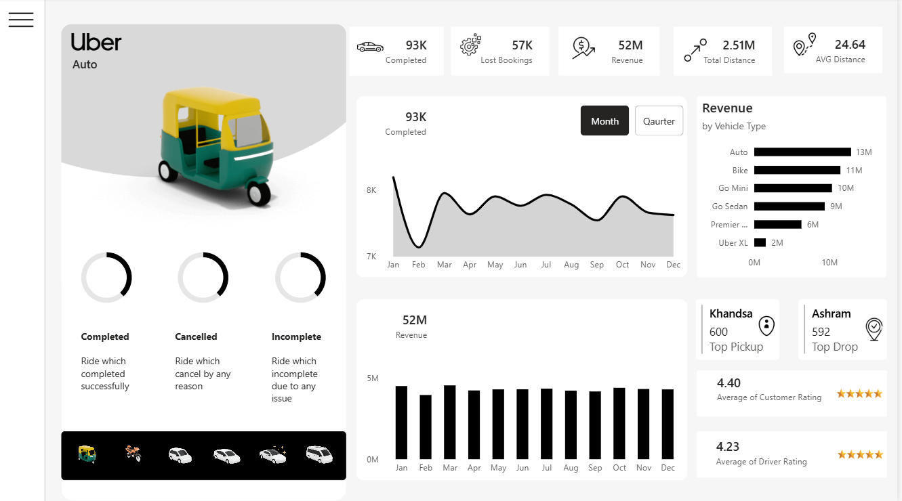

# Uber Trip Insights Dashboard using Power BI


## 📘 Project Overview

This project analyzes **Uber trip data** to uncover meaningful trends and patterns using **Microsoft Power BI**. The goal is to transform raw trip information into actionable insights that help understand ride demand, peak usage times, and location-based trip distribution.

Data cleaning and transformation were performed using **Power Query** inside Power BI. The cleaned and modeled data is then used to create an **interactive and informative dashboard** that highlights key performance indicators (KPIs) and visualizes trends in Uber trip activity.

---

## 🔍 Key Features

✔ Interactive dashboard with slicers and filters  
✔ Analysis of trip distribution across time (hour/day/month)  
✔ Identification of peak hours and high-traffic locations  
✔ Visual KPIs showing total trips, revenue (if available), and trends  
✔ User-friendly visuals for data exploration

---

## 📂 Folder Structure
```
Uber_Data_Analysis_PowerBI/
│
├── dataset/
│ ├── Uber Trip Details.xlsx
│ └── Location Details.xlsx
│
├── powerbi/
│ └── UberDashboard.pbix
│
├── images/
│ ├── dashboard_overview.png
│ └── key_visuals.png
│
└── README.md
```

---

## 📊 Dashboard Preview

Below is a preview of the dashboard visuals showing interactive graphs and key insights (add your own screenshots here):


Uber Trip Overview Analysis Dashboard built using Power BI
---

## 📌 Tools & Technologies

| Technology | Purpose |
|------------|----------|
| Power BI | Visualization, Data modeling |
| Power Query | Data cleaning and transformation |
| Excel | Source data storage |

> Power Query was used to trim, clean, and transform raw data before building the dashboard.

---

## 🧠 Insights (Example)

- Peak trip times occur during [mention your data’s peak hours]  
- Most trips originate from high-traffic pickup locations  
- Trends over time show [increase/decrease—fill with what you found]

*(Customize this section with your actual insights)*

---

## 📥 How to Use

1. **Clone or download** this repository  
2. Make sure dataset files are in the `/dataset` folder  
3. Open `UberDashboard.pbix` in Power BI Desktop  
4. Refresh the report to load data from the updated path  
5. Explore visuals and slicers interactively  

---

## 📌 Notes

- The Power BI file is linked to the dataset using a relative path so that refreshing data works if PBIX and dataset files are kept together.  
- PBIX may show errors if the dataset is moved without updating the source via **Transform Data → Data source settings → Change Source**.

---

## 👍 Acknowledgements

This project improves data storytelling skills using Power BI and demonstrates the ability to convert real-world datasets into business insights.

---

## 👤 Contact

**Santosh Chauhan** *Data Enthusiast*

[](https://www.linkedin.com/in/santosh-chauhan-743b65246/)
[](https://github.com/csantosh350))
[](mailto:csantosh350@gmail.com)

---

